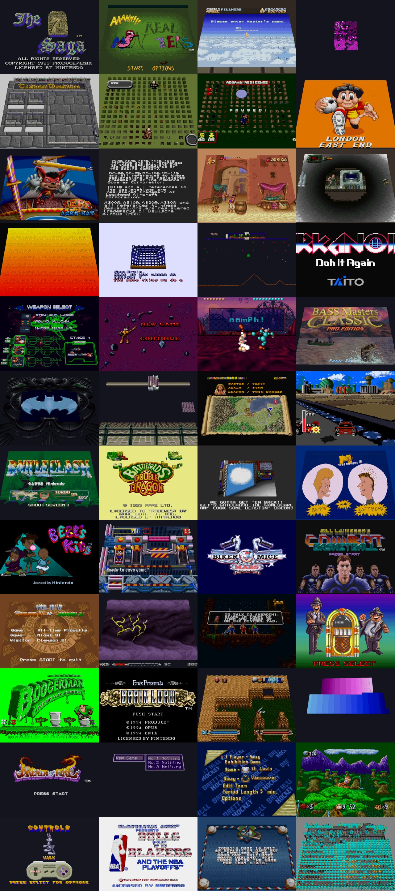
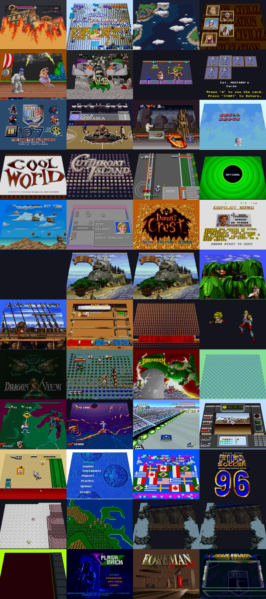
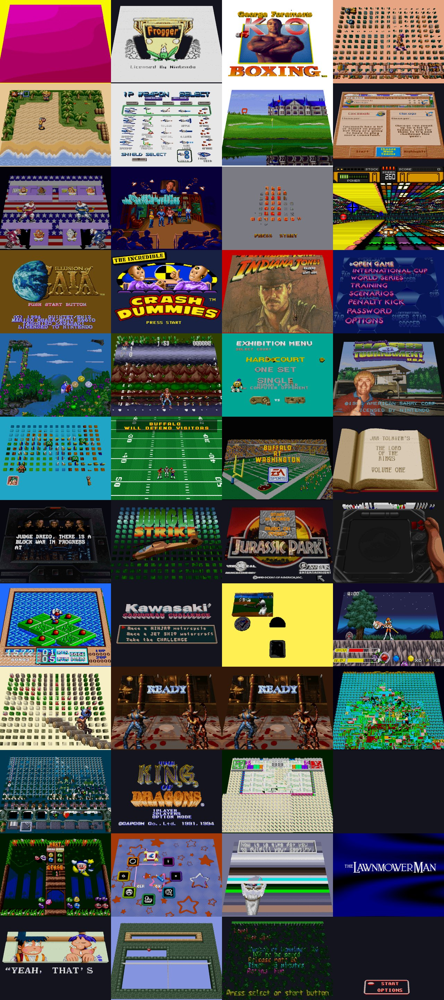
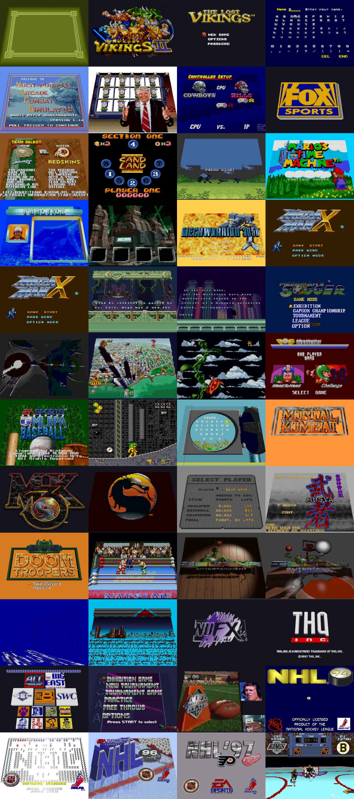
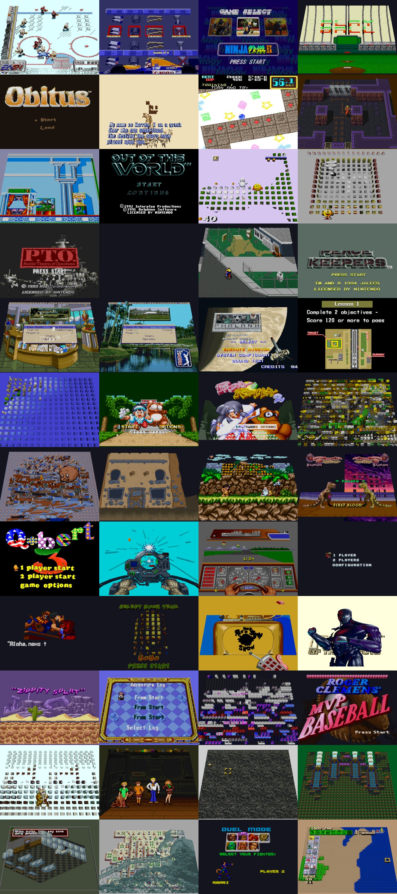
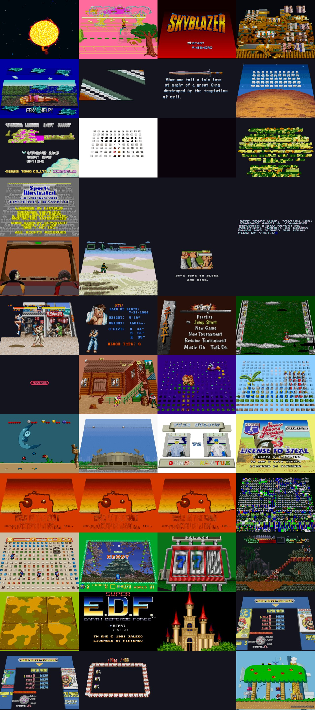
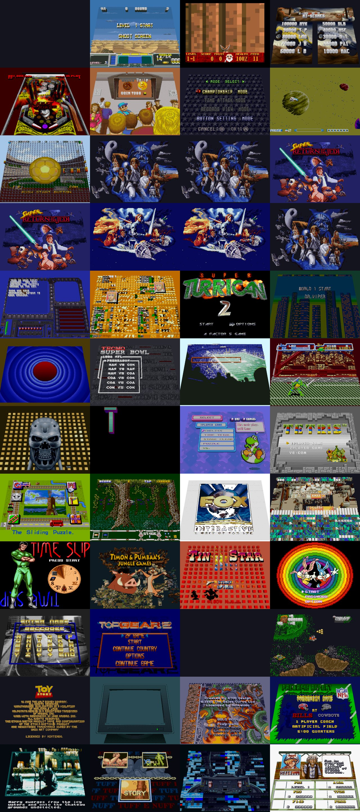
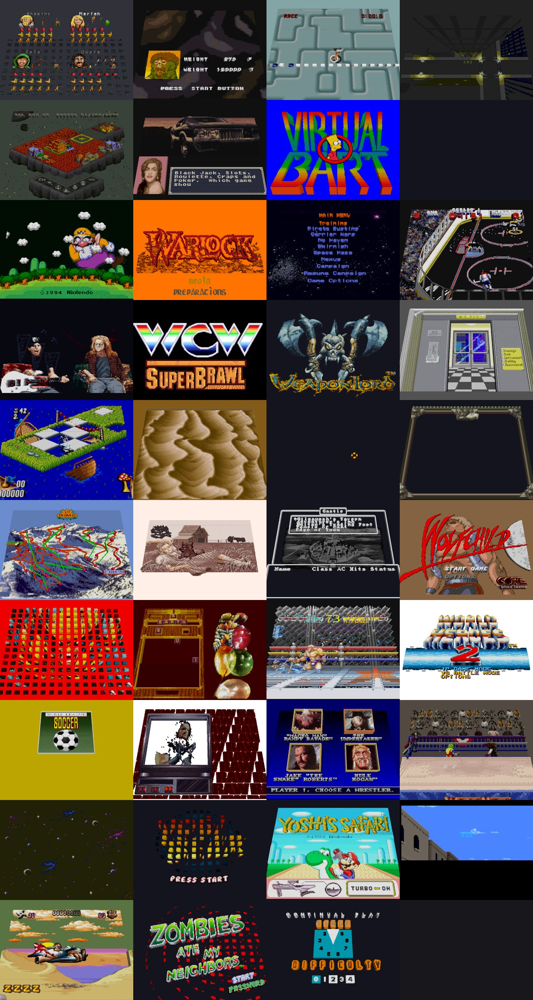

# 3dSNES Compatibility

Every US clean-dump ROM in the test corpus (`*(U)*[!]*`), 375 games, run unattended via `--test`: the harness boots each game, walks it past the attract screen with scripted input, switches to 3D and captures three frames plus a diagnostic JSON.

Status is measured from those captures, not hand-graded — it says whether the 3D view produced a picture, not whether the picture is beautiful. Browse the [gallery sheets](docs/gallery) to judge that yourself.

| Status | Games | Meaning |
|---|---:|---|
| renders | 340 (91%) | 3D view draws the scene |
| Mode 7 | 24 (6%) | PPU Mode 7 at capture — 3D falls back to 2D by design |
| 3D blank | 2 (1%) | game runs in 2D but the 3D view is empty |
| no output | 9 (2%) | game does not boot — unsupported coprocessor |

## Known gaps

Every game that never turns the screen on needs a cartridge coprocessor the emulation core does not cover — none of these is a 3D-rendering failure.

- **Dirt Trax FX** — Super FX
- **Kirby Super Star** — SA-1 (not emulated)
- **Star Fox (V1.0)** — Super FX
- **Star Fox (V1.2)** — Super FX
- **Street Fighter Alpha 2** — SA-1 (not emulated)
- **Super Mario RPG - Legend of the Seven Stars** — SA-1 (not emulated)
- **Super Mario World 2 - Yoshi's Island (V1.0)** — Super FX 2
- **Top Gear 3000** — DSP-4 (not emulated)
- **Vortex** — Super FX
- **Paladin's Quest** — runs in 2D, 3D view stayed empty
- **Spectre** — runs in 2D, 3D view stayed empty

## Gallery

### 7th Saga, The — Cannondale Cup

### Castlevania - Dracula X — Frank Thomas Big Hurt Baseball

### Frantic Flea — Lethal Weapon

### Liberty or Death — NHL Stanley Cup

### NHLPA Hockey 93 — Sim City

### Sim Earth - The Living Planet — Super Mario World

### Super Mario World 2 - Yoshi's Island (V1.0) — U.N. Squadron

### Ultima - Runes of Virtue II — Zoop

## Full results

| Game | Status | PPU mode | Voxels | Sheet |
|---|---|---:|---:|---:|
| 7th Saga, The | renders | 1 | 61308 | 1 |
| AAAHH Real Monsters | renders | 1 | 93026 | 1 |
| ActRaiser | renders | 1 | 65118 | 1 |
| ActRaiser 2 | renders | 1 | 4112 | 1 |
| AD D - Eye of the Beholder | renders | 1 | 56312 | 1 |
| Addams Family Values | renders | 1 | 19962 | 1 |
| Addams Family, The | renders | 1 | 12716 | 1 |
| Adventures of Kid Kleets, The | renders | 1 | 85772 | 1 |
| Aero the Acro-Bat | renders | 3 | 57096 | 1 |
| Aerobiz | renders | 1 | 4200 | 1 |
| Aladdin | renders | 1 | 88121 | 1 |
| Alien 3 | renders | 1 | 86195 | 1 |
| Andre Agassi Tennis | renders | 3 | 57344 | 1 |
| Animaniacs | renders | 1 | 36416 | 1 |
| Arcade's Greatest Hits | renders | 1 | 452 | 1 |
| Arkanoid - Doh It Again | renders | 1 | 48739 | 1 |
| Axelay | renders | 1 | 69996 | 1 |
| B.O.B. | renders | 1 | 7809 | 1 |
| Ballz 3D | Mode 7 | 7 | 43230 | 1 |
| Bass Masters Classic - Pro Edition | renders | 3 | 50523 | 1 |
| Batman Forever | renders | 1 | 40820 | 1 |
| Batman Returns | renders | 1 | 32777 | 1 |
| Battle Blaze | renders | 1 | 61298 | 1 |
| Battle Cars | Mode 7 | 7 | 11864 | 1 |
| Battle Clash | renders | 1 | 59885 | 1 |
| Battletoads Double Dragon - The Ultimate Team | renders | 1 | 10901 | 1 |
| Battletoads in Battlemaniacs | renders | 1 | 55240 | 1 |
| Beavis and Butt-head | renders | 1 | 117889 | 1 |
| Bebe's Kids | renders | 1 | 102418 | 1 |
| Big Sky Trooper | renders | 1 | 61301 | 1 |
| Biker Mice From Mars | renders | 1 | 0 | 1 |
| Bill Laimbeer's Combat Basketball | renders | 1 | 32456 | 1 |
| Bill Walsh College Football | renders | 1 | 60752 | 1 |
| Bio Metal | renders | 2 | 54101 | 1 |
| Blackthorne | renders | 1 | 29503 | 1 |
| Blues Brothers, The | Mode 7 | 7 | 14734 | 1 |
| Boogerman - A Pick and Flick Adventure | renders | 1 | 22985 | 1 |
| Brain Lord | renders | 1 | 19508 | 1 |
| Brandish | renders | 1 | 60015 | 1 |
| Brawl Brothers | renders | 1 | 23936 | 1 |
| Breath of Fire | renders | 1 | 8089 | 1 |
| Breath of Fire II | renders | 1 | 10232 | 1 |
| Brett Hull Hockey | renders | 1 | 62732 | 1 |
| Bubsy in Claws Encounters of the Furred Kind | renders | 1 | 79870 | 1 |
| Bugs Bunny - Rabbit Rampage | renders | 1 | 9301 | 1 |
| Bulls Vs Blazers and the NBA Playoffs (V1.1) | renders | 1 | 14676 | 1 |
| Cal Ripken Jr. Baseball | renders | 1 | 65901 | 1 |
| Cannondale Cup | renders | 1 | 61892 | 1 |
| Castlevania - Dracula X | renders | 1 | 101651 | 2 |
| Chester Cheetah - Too Cool to Fool | renders | 1 | 37605 | 2 |
| Chrono Trigger | renders | 1 | 0 | 2 |
| Civilization | renders | 1 | 0 | 2 |
| Clay Fighter | renders | 1 | 75305 | 2 |
| Clay Fighter 2 - Judgment Clay | renders | 1 | 62860 | 2 |
| Claymates | renders | 1 | 26547 | 2 |
| Clue | renders | 1 | 22417 | 2 |
| College Football USA 97 - The Road to New Orleans | renders | 1 | 23909 | 2 |
| College Slam Basketball | renders | 3 | 11994 | 2 |
| Contra III - The Alien Wars | renders | 1 | 69640 | 2 |
| Cool Spot | renders | 1 | 101999 | 2 |
| Cool World | renders | 3 | 47579 | 2 |
| Cutthroat Island | renders | 1 | 30266 | 2 |
| Cyber Spin | renders | 1 | 61987 | 2 |
| Daffy Duck - The Marvin Missions | renders | 1 | 53799 | 2 |
| Darius Twin | renders | 1 | 2824 | 2 |
| David Crane's Amazing Tennis | renders | 1 | 36029 | 2 |
| Demon's Crest | renders | 1 | 78654 | 2 |
| Desert Strike - Return to the Gulf | renders | 1 | 19437 | 2 |
| Dirt Trax FX | no output | 3 | 0 | 2 |
| Donkey Kong Country (V1.0) | renders | 1 | 94531 | 2 |
| Donkey Kong Country (V1.1) | renders | 1 | 94531 | 2 |
| Donkey Kong Country (V1.2) | renders | 1 | 52474 | 2 |
| Donkey Kong Country 2 - Diddy's Kong Quest (V1.1) | renders | 1 | 81562 | 2 |
| Donkey Kong Country 3 - Dixie Kong's Double Trouble | renders | 1 | 121134 | 2 |
| Doom | renders | 3 | 48833 | 2 |
| Doomsday Warrior | renders | 1 | 5399 | 2 |
| Dragon View | renders | 1 | 63244 | 2 |
| Dragon's Lair | renders | 1 | 28163 | 2 |
| Drakkhen | renders | 1 | 91778 | 2 |
| Earthbound | renders | 1 | 57344 | 2 |
| Earthworm Jim | renders | 1 | 55608 | 2 |
| Earthworm Jim 2 | renders | 1 | 106421 | 2 |
| F-ZERO | Mode 7 | 7 | 58713 | 2 |
| Faceball 2000 | renders | 1 | 62194 | 2 |
| Family Dog | renders | 1 | 81711 | 2 |
| FIFA 97 - Gold Edition | renders | 1 | 60819 | 2 |
| FIFA International Soccer | renders | 1 | 79132 | 2 |
| FIFA Soccer 96 | renders | 1 | 61689 | 2 |
| Final Fantasy - Mystic Quest (V1.0) | renders | 1 | 70665 | 2 |
| Final Fantasy II (V1.0) | renders | 1 | 30480 | 2 |
| Final Fantasy III (V1.0) | renders | 1 | 104331 | 2 |
| Final Fantasy III (V1.1) | renders | 1 | 104331 | 2 |
| First Samurai | renders | 1 | 19630 | 2 |
| Flashback - The Quest for Identity | renders | 1 | 49702 | 2 |
| Foreman For Real | renders | 1 | 32872 | 2 |
| Frank Thomas Big Hurt Baseball | renders | 1 | 57658 | 2 |
| Frantic Flea | renders | 1 | 95445 | 3 |
| Frogger | renders | 1 | 0 | 3 |
| George Foreman's KO Boxing (V1.0) | renders | 3 | 29661 | 3 |
| Gods | renders | 1 | 16615 | 3 |
| Goof Troop | renders | 1 | 72795 | 3 |
| Gradius III | renders | 1 | 9630 | 3 |
| HAL's Hole in One Golf | renders | 1 | 57438 | 3 |
| Hardball III | renders | 1 | 50830 | 3 |
| Hit the Ice | renders | 1 | 122030 | 3 |
| Home Improvement | renders | 1 | 37757 | 3 |
| Hunt for Red October, The | renders | 1 | 4211 | 3 |
| HyperZone | Mode 7 | 7 | 37954 | 3 |
| Illusion of Gaia | renders | 1 | 25796 | 3 |
| Incredible Crash Dummies, The | Mode 7 | 7 | 39044 | 3 |
| Indiana Jones Greatest Adventures | renders | 3 | 61375 | 3 |
| International Superstar Soccer | renders | 1 | 62549 | 3 |
| Izzy's Quest for the Olympic Rings | renders | 1 | 56699 | 3 |
| Jim Power - The Lost Dimension in 3D | renders | 1 | 64521 | 3 |
| Jimmy Connors Pro Tennis Tour | renders | 1 | 6359 | 3 |
| Jimmy Houston's Bass Tournament U.S.A. | renders | 1 | 57176 | 3 |
| Joe Mac | renders | 1 | 13055 | 3 |
| John Madden Football 93 (V1.0) | Mode 7 | 7 | 32919 | 3 |
| John Madden Football 93 (V1.1) | Mode 7 | 7 | 35300 | 3 |
| JRR Tolkien's The Lord of the Rings - Volume 1 | renders | 1 | 85990 | 3 |
| Judge Dredd | renders | 1 | 43793 | 3 |
| Jungle Strike | renders | 1 | 34115 | 3 |
| Jurassic Park (V1.0) | renders | 3 | 52623 | 3 |
| Jurassic Park Part 2 - The Chaos Continues | renders | 1 | 52453 | 3 |
| Kablooey | renders | 1 | 80805 | 3 |
| Kawasaki Caribbean Challenge | renders | 3 | 17315 | 3 |
| Ken Griffey Jr. s Winning Run | renders | 1 | 34011 | 3 |
| Kendo Rage | renders | 1 | 77540 | 3 |
| Kid Klown in Crazy Chase | renders | 1 | 59675 | 3 |
| Killer Instinct (V1.0) | renders | 1 | 61386 | 3 |
| Killer Instinct (V1.1) | renders | 1 | 63347 | 3 |
| King Arthur The Knights of Justice | renders | 1 | 55258 | 3 |
| King Arthur's World | renders | 1 | 59701 | 3 |
| King of Dragons, The | renders | 1 | 15103 | 3 |
| King of the Monsters 2 | renders | 1 | 70838 | 3 |
| Kirby Super Star | no output | 4 | 0 | 3 |
| Kirby's Avalanche | renders | 2 | 44698 | 3 |
| Kirby's Dream Course | renders | 1 | 72227 | 3 |
| Lagoon | renders | 1 | 131 | 3 |
| Lawnmower Man, The | Mode 7 | 7 | 31806 | 3 |
| Legend of The Mystical Ninja, The | renders | 1 | 25732 | 3 |
| Legend of Zelda, The - A Link to the Past | renders | 1 | 35680 | 3 |
| Lemmings (V1.1) | renders | 1 | 29220 | 3 |
| Lethal Weapon | renders | 1 | 1298 | 3 |
| Liberty or Death | renders | 1 | 58578 | 4 |
| Lost Vikings II, The | renders | 1 | 41909 | 4 |
| Lost Vikings, The | renders | 1 | 53977 | 4 |
| Lufia The Fortress of Doom | renders | 1 | 1985 | 4 |
| M.A.C.S. Basic Rifle Simulator | renders | 1 | 59316 | 4 |
| Madden NFL 94 | renders | 3 | 64230 | 4 |
| Madden NFL 95 | renders | 1 | 65444 | 4 |
| Madden NFL 96 | renders | 1 | 33145 | 4 |
| Madden NFL 97 | renders | 1 | 95903 | 4 |
| Magic Boy | Mode 7 | 7 | 45553 | 4 |
| Magical Quest Starring Mickey Mouse, The | renders | 1 | 69020 | 4 |
| Mario's Time Machine | renders | 1 | 20110 | 4 |
| Mark Davis The Fishing Master | renders | 1 | 69222 | 4 |
| Mechwarrior | renders | 1 | 49170 | 4 |
| Mechwarrior 3050 | renders | 1 | 56513 | 4 |
| Mega Man X (V1.0) | renders | 1 | 13143 | 4 |
| Mega Man X (V1.1) | renders | 1 | 13143 | 4 |
| Mega Man X 2 | renders | 1 | 114421 | 4 |
| Mega Man X 3 | renders | 1 | 81769 | 4 |
| Mega Man's Soccer | renders | 1 | 13353 | 4 |
| Metal Combat - Falcon's Revenge | renders | 1 | 0 | 4 |
| Michael Jordan - Chaos in the Windy City | renders | 3 | 65352 | 4 |
| Mickey Mania | renders | 1 | 52702 | 4 |
| Micro Machines | renders | 1 | 13891 | 4 |
| MLBPA Baseball | renders | 1 | 61726 | 4 |
| MoHawk Headphone Jack | Mode 7 | 7 | 42737 | 4 |
| Monopoly (V1.0) | renders | 1 | 52687 | 4 |
| Mortal Kombat | renders | 1 | 67076 | 4 |
| Mortal Kombat 3 | renders | 1 | 56790 | 4 |
| Mortal Kombat II (V1.0) | renders | 3 | 81710 | 4 |
| Mountain Bike Rally | renders | 1 | 48324 | 4 |
| Musya | renders | 1 | 67563 | 4 |
| Mutant Chronicles - Doom Troopers | renders | 1 | 21982 | 4 |
| Natsume Championship Wrestling | renders | 2 | 62058 | 4 |
| NBA Jam (V1.1) | renders | 3 | 49997 | 4 |
| NBA Jam - Tournament Edition | renders | 3 | 25409 | 4 |
| NBA Live 95 | renders | 1 | 41229 | 4 |
| NBA Live 96 | renders | 1 | 46679 | 4 |
| NBA Live 97 | renders | 1 | 59245 | 4 |
| NBA Live 98 | renders | 1 | 72055 | 4 |
| NCAA Basketball (V1.1) | renders | 1 | 29855 | 4 |
| NCAA Final Four Basketball | renders | 2 | 36262 | 4 |
| NFL Quarterback Club 96 | renders | 4 | 51088 | 4 |
| NHL 94 | renders | 1 | 65533 | 4 |
| NHL 95 | renders | 1 | 8117 | 4 |
| NHL 96 | renders | 1 | 110193 | 4 |
| NHL 97 | renders | 1 | 23224 | 4 |
| NHL Stanley Cup | renders | 1 | 61812 | 4 |
| NHLPA Hockey 93 | renders | 1 | 33841 | 5 |
| Nigel Mansell's World Championship Racing | renders | 1 | 5485 | 5 |
| Ninja Gaiden Trilogy | renders | 1 | 78190 | 5 |
| Nolan Ryan's Baseball | renders | 1 | 58889 | 5 |
| Obitus | renders | 2 | 37177 | 5 |
| Ogre Battle - The March of the Black Queen | renders | 1 | 348 | 5 |
| On the Ball | Mode 7 | 7 | 13723 | 5 |
| Operation Logic Bomb | renders | 1 | 64579 | 5 |
| Oscar | renders | 1 | 122007 | 5 |
| Out of This World | renders | 1 | 0 | 5 |
| Pac-in-Time | renders | 1 | 7551 | 5 |
| Pac-Man 2 - The New Adventures | renders | 1 | 12738 | 5 |
| Pacific Theater of Operations | renders | 1 | 24916 | 5 |
| Paladin's Quest | 3D blank | 1 | 0 | 5 |
| Paperboy 2 | renders | 1 | 57454 | 5 |
| Peace Keepers, The | renders | 1 | 0 | 5 |
| PGA European Tour | renders | 1 | 67461 | 5 |
| PGA Tour 96 | renders | 1 | 68434 | 5 |
| Phalanx - The Enforce Fighter A-144 | renders | 1 | 79994 | 5 |
| Pilotwings | Mode 7 | 7 | 693 | 5 |
| Plok | renders | 1 | 31587 | 5 |
| Pocky Rocky | renders | 1 | 49726 | 5 |
| Pocky Rocky 2 | renders | 1 | 50541 | 5 |
| Populous | renders | 1 | 51317 | 5 |
| Porky Pig's Haunted Holiday | renders | 3 | 62425 | 5 |
| Power Piggs of the Dark Age | renders | 1 | 109437 | 5 |
| Prehistorik Man | renders | 1 | 79993 | 5 |
| Primal Rage | renders | 1 | 50695 | 5 |
| Q-bert 3 | Mode 7 | 7 | 11875 | 5 |
| R-Type III - The Third Lightning | renders | 1 | 16093 | 5 |
| Race Drivin | renders | 1 | 37531 | 5 |
| Raiden Trad | renders | 1 | 1304 | 5 |
| Ranma Nibunnoichi - Hard Battle | renders | 1 | 8855 | 5 |
| Rap Jam - Volume One | renders | 1 | 6343 | 5 |
| Ren Stimpy Show, The - Buckeroos | renders | 1 | 0 | 5 |
| Rise of the Robots | renders | 3 | 23516 | 5 |
| Road Runner's Death Valley Rally | renders | 1 | 53961 | 5 |
| Robotrek | renders | 1 | 71793 | 5 |
| Rock N Roll Racing | renders | 1 | 87360 | 5 |
| Roger Clemens MVP Baseball | renders | 1 | 39744 | 5 |
| Run Saber | renders | 1 | 23727 | 5 |
| Scooby-Doo | renders | 1 | 68138 | 5 |
| Secret of Evermore | renders | 4 | 59536 | 5 |
| Secret of Mana | renders | 1 | 65815 | 5 |
| Shadowrun | renders | 1 | 44488 | 5 |
| Shanghai II - Dragon's Eye | renders | 1 | 59321 | 5 |
| Shaq Fu | renders | 1 | 8137 | 5 |
| Sim City | renders | 1 | 64923 | 5 |
| Sim Earth - The Living Planet | Mode 7 | 7 | 8901 | 6 |
| Simpsons, The - Bart's Nightmare | renders | 0 | 19056 | 6 |
| Sky Blazer | renders | 1 | 67206 | 6 |
| Soldiers of Fortune | renders | 3 | 0 | 6 |
| Sonic Blast Man | renders | 1 | 59138 | 6 |
| SOS | renders | 0 | 1477 | 6 |
| Soul Blazer | renders | 1 | 4013 | 6 |
| Space Invaders | renders | 1 | 59618 | 6 |
| Space Megaforce | renders | 1 | 11764 | 6 |
| Spawn | renders | 1 | 5407 | 6 |
| Spectre | 3D blank | 1 | 0 | 6 |
| Speedy Gonzales - Los Gatos Bandidos (V1.1) | renders | 1 | 76003 | 6 |
| Sports Illustrated Championship Football Baseball | renders | 1 | 20163 | 6 |
| Star Fox (V1.0) | no output | 2 | 0 | 6 |
| Star Fox (V1.2) | no output | 2 | 0 | 6 |
| Star Trek - Deep Space Nine - Crossroads of Time | renders | 1 | 53476 | 6 |
| Star Trek - The Next Generation - Future's Past | renders | 1 | 42457 | 6 |
| Stargate | renders | 1 | 71395 | 6 |
| Street Combat | renders | 1 | 7171 | 6 |
| Street Fighter Alpha 2 | no output | 1 | 0 | 6 |
| Street Fighter II - The World Warrior | renders | 1 | 55088 | 6 |
| Street Fighter II Turbo - Hyper Fighting | renders | 1 | 55442 | 6 |
| Street Hockey 95 | renders | 1 | 22293 | 6 |
| Strike Gunner | renders | 2 | 28022 | 6 |
| Stunt Race FX | renders | 1 | 521 | 6 |
| Sunset Riders | renders | 1 | 55070 | 6 |
| Super Adventure Island | renders | 1 | 20525 | 6 |
| Super Adventure Island II | renders | 1 | 17550 | 6 |
| Super Alfred Chicken | renders | 1 | 15022 | 6 |
| Super Baseball Simulator 1.000 | renders | 3 | 60565 | 6 |
| Super Bases Loaded | renders | 1 | 73851 | 6 |
| Super Bases Loaded 3 - License to Steal (V1.0) | renders | 1 | 0 | 6 |
| Super Battletank - War in the Gulf (V1.0) | Mode 7 | 7 | 23038 | 6 |
| Super Battletank - War in the Gulf (V1.1) | Mode 7 | 7 | 23038 | 6 |
| Super Battletank - War in the Gulf (V1.1) p1 | Mode 7 | 7 | 23038 | 6 |
| Super Black Bass | renders | 1 | 72769 | 6 |
| Super Bomberman 2 | renders | 1 | 18463 | 6 |
| Super Buster Bros. (V1.0) | renders | 1 | 51914 | 6 |
| Super Caesars Palace | renders | 1 | 38684 | 6 |
| Super Castlevania IV | renders | 1 | 36716 | 6 |
| Super Conflict - The Mideast | renders | 1 | 65527 | 6 |
| Super Earth Defense Force | renders | 1 | 66696 | 6 |
| Super Ghouls N Ghosts | renders | 1 | 55214 | 6 |
| Super Mario All-Stars | renders | 3 | 31680 | 6 |
| Super Mario All-Stars + Super Mario World | renders | 3 | 31590 | 6 |
| Super Mario Kart | Mode 7 | 7 | 35508 | 6 |
| Super Mario RPG - Legend of the Seven Stars | no output | 0 | 0 | 6 |
| Super Mario World | renders | 1 | 51432 | 6 |
| Super Mario World 2 - Yoshi's Island (V1.0) | no output | 1 | 0 | 7 |
| Super NES Super Scope 6 | renders | 1 | 73005 | 7 |
| Super Noah's Ark 3D | Mode 7 | 7 | 4145 | 7 |
| Super Off Road | renders | 1 | 6799 | 7 |
| Super Pinball - Behind the Mask | renders | 4 | 42502 | 7 |
| Super Play Action Football | renders | 1 | 58824 | 7 |
| Super Punch-Out | renders | 1 | 63738 | 7 |
| Super R-Type | renders | 1 | 7865 | 7 |
| Super Soccer Champ | renders | 1 | 70428 | 7 |
| Super Star Wars (V1.0) | renders | 1 | 31697 | 7 |
| Super Star Wars (V1.1) | renders | 1 | 31697 | 7 |
| Super Star Wars - Return of the Jedi (V1.0) | renders | 1 | 36383 | 7 |
| Super Star Wars - Return of the Jedi (V1.1) | renders | 1 | 36383 | 7 |
| Super Star Wars - The Empire Strikes Back (V1.0) | renders | 1 | 30019 | 7 |
| Super Star Wars - The Empire Strikes Back (V1.1) | renders | 1 | 30019 | 7 |
| Super Star Wars Beta p1 | renders | 1 | 31697 | 7 |
| Super Strike Eagle | renders | 3 | 46495 | 7 |
| Super Tennis | renders | 1 | 46721 | 7 |
| Super Turrican 2 | Mode 7 | 7 | 3400 | 7 |
| SWAT Kats - The Radical Squadron | renders | 1 | 151530 | 7 |
| Taz-Mania | renders | 3 | 59254 | 7 |
| Tecmo Super Bowl | renders | 1 | 55401 | 7 |
| Tecmo Super Bowl III - Final Edition | renders | 1 | 66757 | 7 |
| Teenage Mutant Ninja Turtles IV - Turtles in Time | renders | 1 | 79243 | 7 |
| Terminator 2 - Judgment Day | renders | 1 | 0 | 7 |
| Tetris 2 (V1.1) | renders | 1 | 115164 | 7 |
| Tetris Attack | renders | 1 | 103522 | 7 |
| Tetris Dr. Mario | renders | 1 | 85077 | 7 |
| Thomas the Tank Engine and Friends | renders | 1 | 12197 | 7 |
| Thunder Spirits | renders | 1 | 27751 | 7 |
| Tick, The | renders | 1 | 58255 | 7 |
| Timecop | renders | 1 | 60808 | 7 |
| TimeSlip | renders | 1 | 223 | 7 |
| Timon Pumbaa's Jungle Games | renders | 1 | 62826 | 7 |
| Tin Star | renders | 1 | 16395 | 7 |
| Tiny Toon Adventures - Buster Busts Loose | Mode 7 | 7 | 8386 | 7 |
| Top Gear | renders | 1 | 68852 | 7 |
| Top Gear 2 | renders | 1 | 17296 | 7 |
| Top Gear 3000 | no output | 3 | 0 | 7 |
| Total Carnage | renders | 0 | 18912 | 7 |
| Toy Story | renders | 3 | 39375 | 7 |
| Toys | renders | 1 | 24412 | 7 |
| Troddlers | renders | 1 | 25110 | 7 |
| Troy Aikman NFL Football | renders | 1 | 64732 | 7 |
| True Lies | renders | 1 | 26302 | 7 |
| Tuff E Nuff | renders | 1 | 935 | 7 |
| Turn and Burn - No-Fly Zone | renders | 1 | 31340 | 7 |
| U.N. Squadron | renders | 1 | 28915 | 7 |
| Ultima - Runes of Virtue II | renders | 1 | 12169 | 8 |
| Ultraman - Towards the Future | renders | 1 | 62253 | 8 |
| Uniracers | renders | 1 | 60813 | 8 |
| Urban Strike | renders | 1 | 15421 | 8 |
| Utopia - The Creation of a Nation | renders | 1 | 31820 | 8 |
| Vegas Stakes | renders | 1 | 55036 | 8 |
| Virtual Bart | renders | 1 | 0 | 8 |
| Vortex | no output | 0 | 0 | 8 |
| Wario's Woods | renders | 1 | 98604 | 8 |
| Warlock | renders | 1 | 71729 | 8 |
| WarpSpeed | renders | 1 | 11312 | 8 |
| Wayne Gretzky and the NHLPA All-Stars | renders | 1 | 25891 | 8 |
| Wayne's World | Mode 7 | 7 | 15404 | 8 |
| WCW Super Brawl Wrestling | renders | 1 | 46200 | 8 |
| Weapon Lord | renders | 1 | 25606 | 8 |
| Where in Time is Carmen Sandiego | renders | 1 | 68646 | 8 |
| Whizz | renders | 1 | 85479 | 8 |
| WildSnake | renders | 1 | 57532 | 8 |
| Wing Commander | renders | 0 | 80 | 8 |
| Wings 2 - Aces High | renders | 1 | 13727 | 8 |
| Winter Extreme Skiing and Snowboarding | renders | 1 | 61887 | 8 |
| Wizard of Oz, The | renders | 1 | 3602 | 8 |
| Wizardry V - Heart of the Maelstrom | renders | 1 | 25419 | 8 |
| Wolf Child | renders | 1 | 34093 | 8 |
| Wolverine - Adamantium Rage | renders | 2 | 18445 | 8 |
| Wordtris | renders | 3 | 33362 | 8 |
| World Heroes | renders | 1 | 60211 | 8 |
| World Heroes 2 | renders | 1 | 0 | 8 |
| World League Soccer | renders | 1 | 61525 | 8 |
| WWF Raw | renders | 2 | 55928 | 8 |
| WWF Super WrestleMania | renders | 2 | 64232 | 8 |
| WWF WrestleMania - The Arcade Game | renders | 2 | 56837 | 8 |
| Xardion | renders | 1 | 9670 | 8 |
| Yogi Bear | renders | 3 | 6104 | 8 |
| Yoshi's Safari | Mode 7 | 7 | 60429 | 8 |
| Ys III - Wanderers from Ys | renders | 1 | 44724 | 8 |
| Zero the Kamikaze Squirrel | renders | 1 | 66698 | 8 |
| Zombies Ate My Neighbors | renders | 1 | 114026 | 8 |
| Zoop | renders | 3 | 6317 | 8 |
