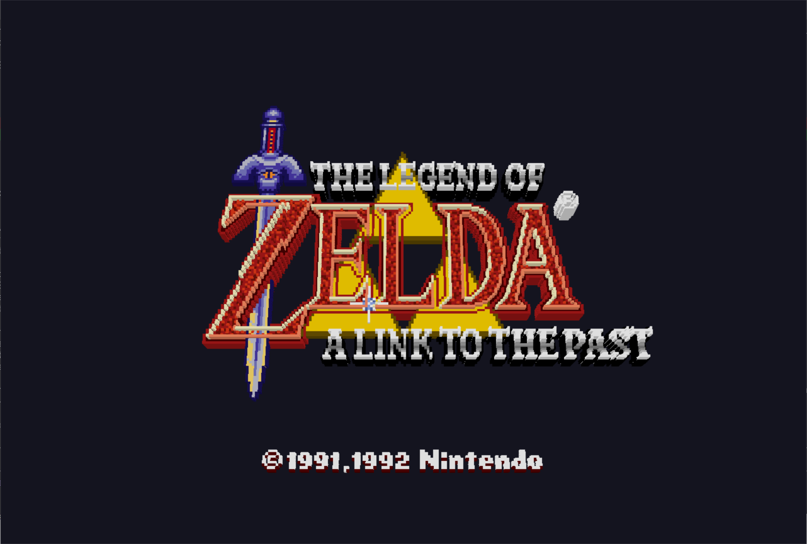

# 3dSNES

**A free, open-source 3D voxel renderer for SNES games.**

Runs real SNES emulation (powered by [LakeSnes](https://github.com/angelo-wf/LakeSnes)) and converts the 2D tile/sprite output into 3D voxel scenes in real-time. Inspired by [3dSen](https://store.steampowered.com/app/1147940/3dSen_PC/) (NES) — this is the SNES equivalent, and it's free.



## How it works

1. **Emulation** — LakeSnes runs the game with full CPU, PPU, APU, and DMA emulation
2. **PPU extraction** — Each frame, tile/sprite/palette data is read directly from PPU state (VRAM, OAM, CGRAM)
3. **Voxelization** — 2D tiles are extruded into 3D voxel blocks with per-layer depth and brightness-based height variation
4. **Rendering** — OpenGL 3.3 instanced rendering draws thousands of colored cubes with directional lighting

## Features

- Real-time 3D voxel rendering of SNES games
- Full SNES audio (SPC700 + DSP at 32040 Hz)
- Controllable orbit camera with preset views
- Per-game depth profiles (layer heights, extrusion, brightness mapping)
- 2D framebuffer overlay toggle for reference
- Wireframe debug mode

## Controls

| Key | Action |
|-----|--------|
| Arrow keys | D-pad |
| Z | A button |
| X | B button |
| A / S | X / Y buttons |
| Q / W | L / R shoulders |
| Tab | Select |
| Enter | Start |
| Mouse drag | Orbit camera |
| Scroll wheel | Zoom |
| Middle drag | Pan |
| 1 / 2 / 3 | Top-down / Isometric / Side view |
| F1 | Toggle 3D / 2D mode |
| F2 | Toggle 2D overlay |
| F3 | Wireframe mode |
| Esc | Quit |

## Building

### Requirements
- CMake 3.16+
- SDL2 (via vcpkg or system)
- OpenGL 3.3+ capable GPU
- C17 compiler (MSVC, GCC, Clang)

### Build
```bash
git clone --recursive https://github.com/sp00nznet/3dsnes.git
cd 3dsnes
mkdir build && cd build
cmake .. -DCMAKE_TOOLCHAIN_FILE=/path/to/vcpkg/scripts/buildsystems/vcpkg.cmake
cmake --build . --config Release
```

### Run
```bash
./3dsnes path/to/rom.sfc
```

## Architecture

```
SNES ROM
   |
   v
LakeSnes (full SNES emulation)
   |
   v
PPU State Extraction (VRAM, OAM, CGRAM, BG registers)
   |
   v
Voxelizer (tiles/sprites -> 3D cube instances)
   |
   v
OpenGL 3.3 Instanced Renderer (cube mesh x N instances)
   |
   v
SDL2 Window + Audio Output
```

## Focus Titles

- **The Legend of Zelda: A Link to the Past** — top-down Mode 1, great diorama effect
- **Super Mario World** — side-scroller with clean sprite work
- **Mega Man X** — side-scroller with distinct art style

## Credits

- [LakeSnes](https://github.com/angelo-wf/LakeSnes) by angelo-wf — SNES emulation core (MIT)
- [glad](https://github.com/Dav1dde/glad) — OpenGL loader
- [SDL2](https://www.libsdl.org/) — windowing, audio, input

## License

MIT
