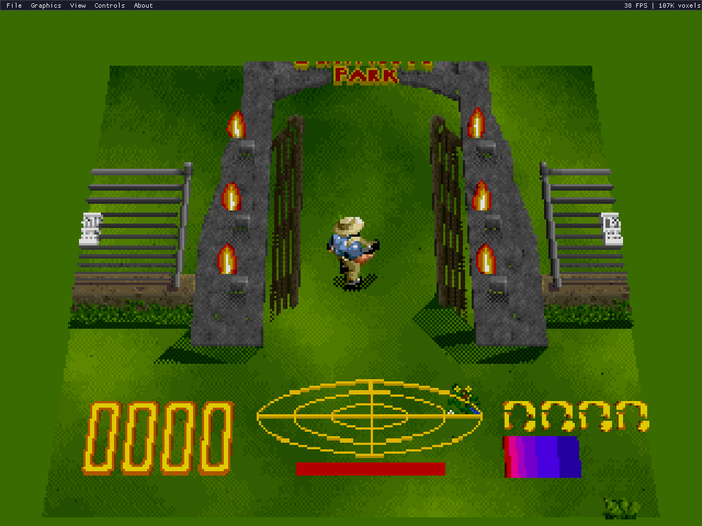
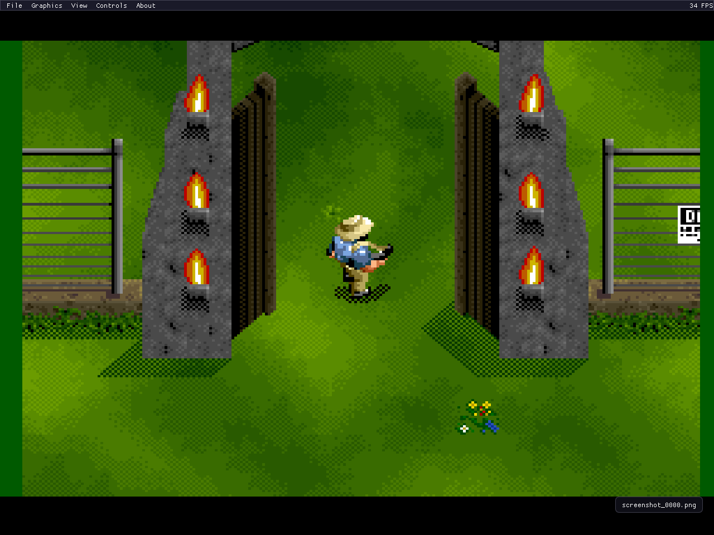
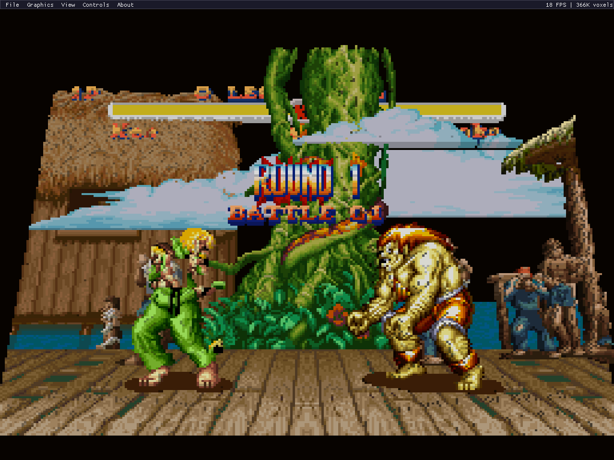
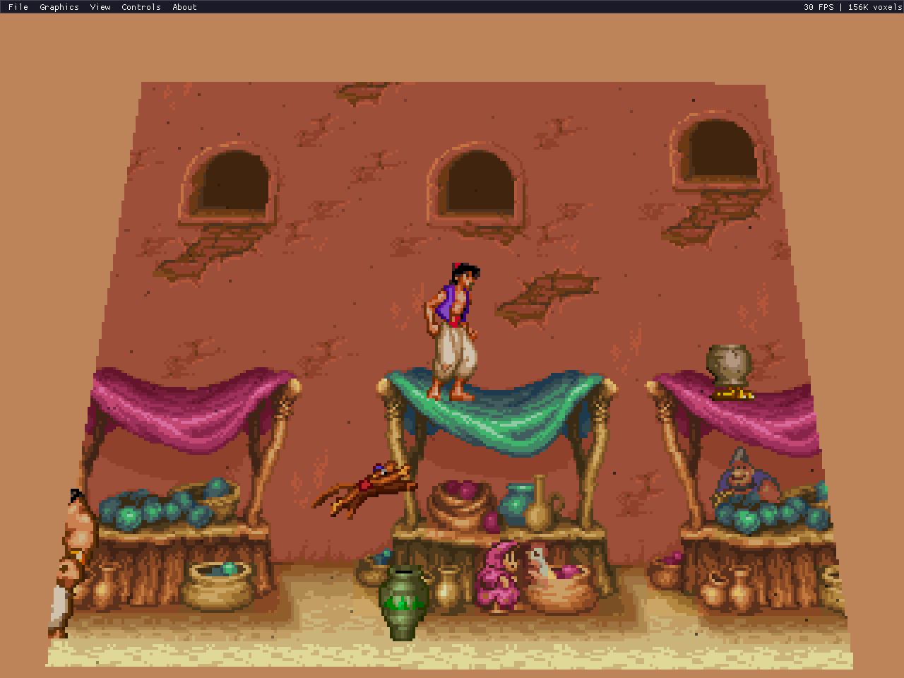
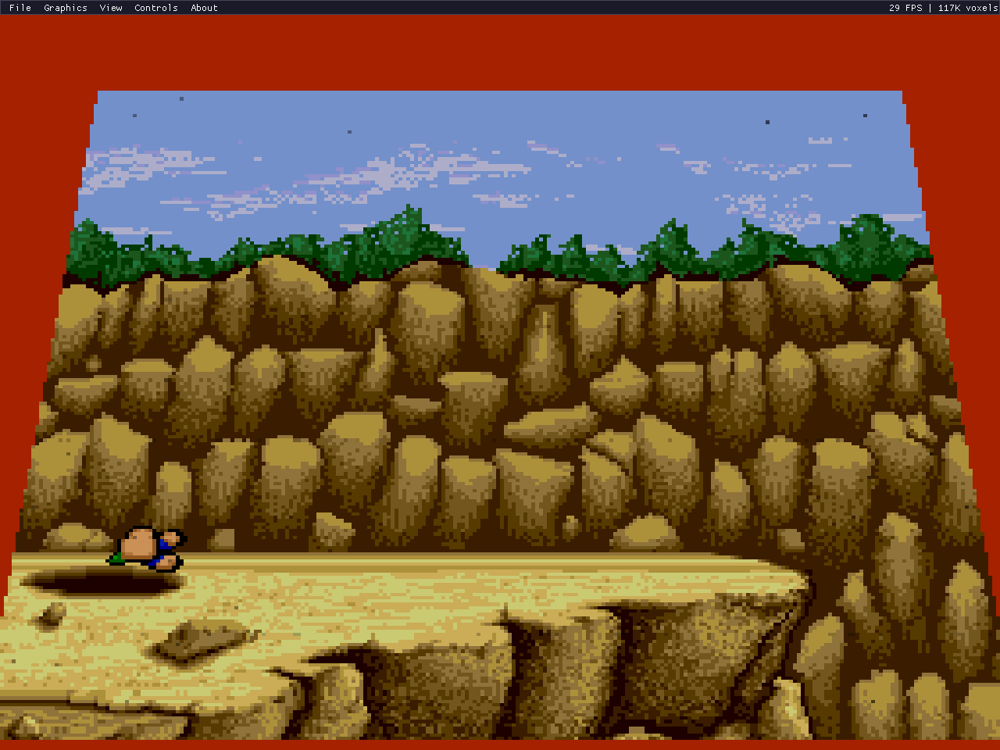
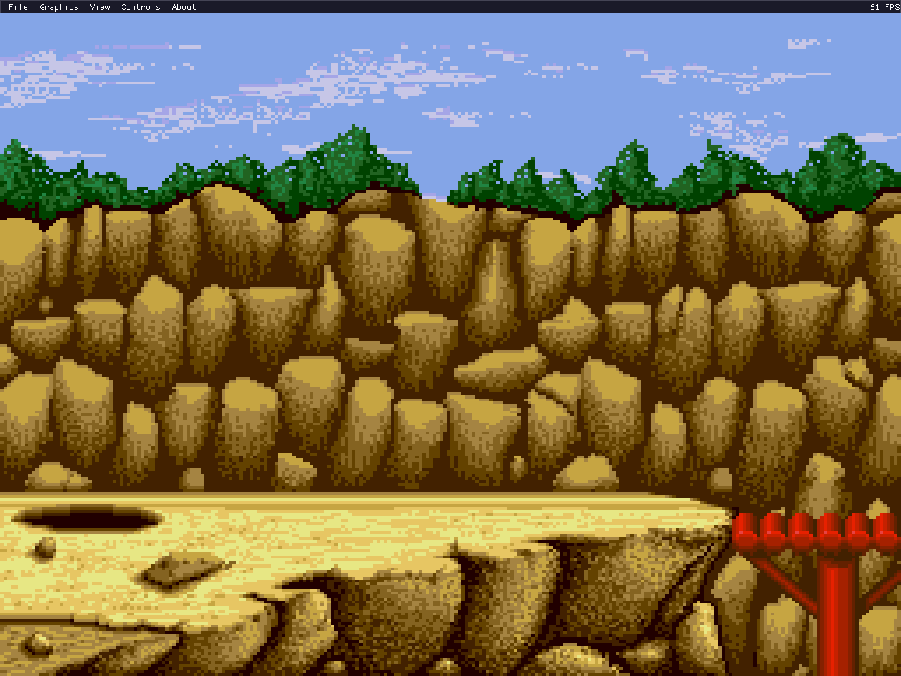
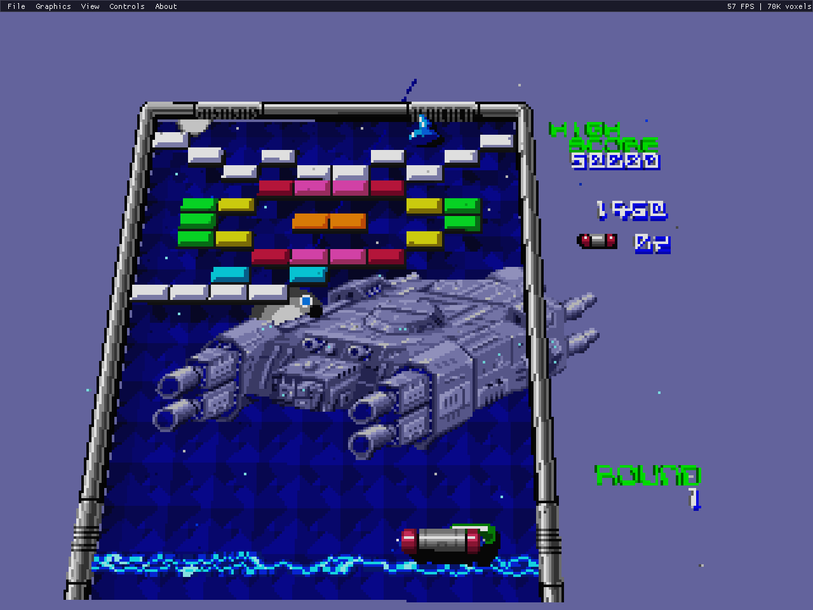
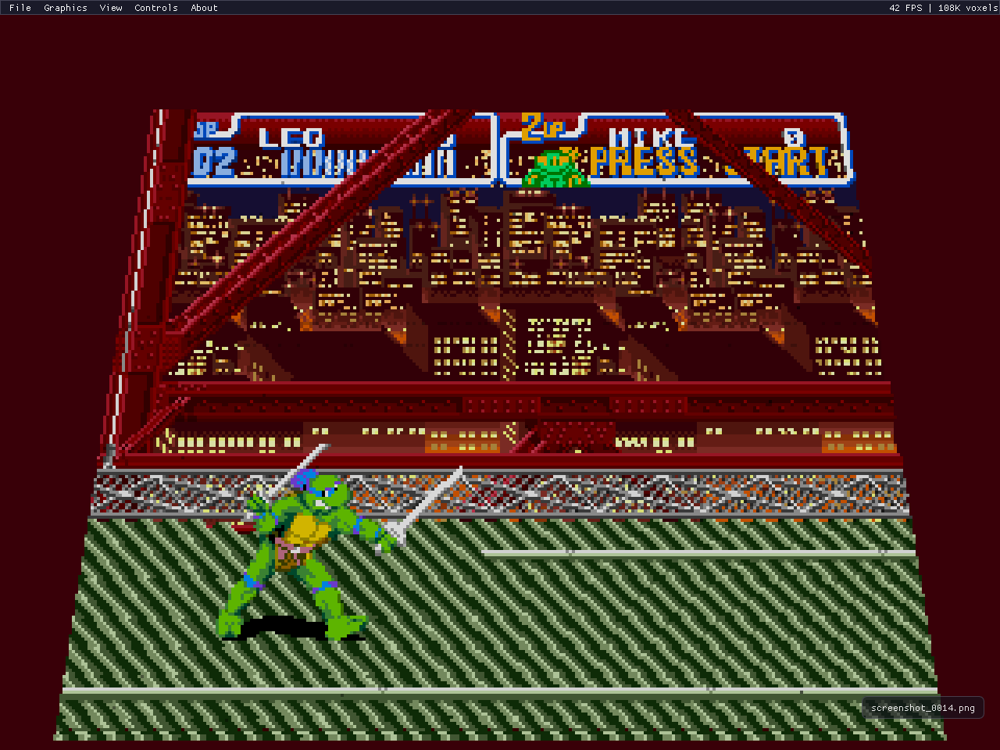
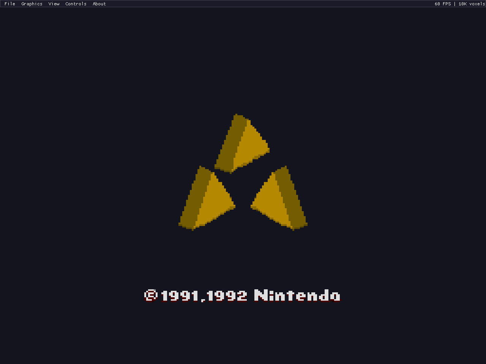

# 3dSNES

**A free, open-source 3D voxel renderer for SNES games.**

Runs real SNES emulation (powered by [LakeSnes](https://github.com/sp00nznet/LakeSnes)) and converts the 2D tile/sprite output into 3D voxel scenes in real-time. Inspired by [3dSen](https://store.steampowered.com/app/1147940/3dSen_PC/) (NES) — this is the SNES equivalent, and it's free.

## Screenshots

| | |
|:---:|:---:|
|  |  |
| *Jurassic Park — 3D voxel diorama* | *Jurassic Park — original 2D* |
|  |  |
| *Super Street Fighter II — 3D arena* | *Aladdin — Agrabah marketplace* |
|  |  |
| *Lemmings — rocky cliff in 3D* | *Lemmings — original 2D* |
|  |  |
| *Arkanoid — bricks as 3D blocks* | *TMNT IV — bridge fight* |
|  | |
| *Zelda: ALTTP — Triforce intro* | |

## Features

### Emulation
- Full SNES emulation via LakeSnes (CPU, PPU, APU/SPC700, DMA)
- Full SNES audio with per-channel mute and master volume control
- SNES Mouse support (for Mario Paint, etc.)
- Super Scope light gun support (for Super Scope 6, Yoshi's Safari, Battle Clash, etc.)
- 2-player keyboard input with rebindable keys
- Save states (F5 save / F7 load)
- LoROM, HiROM, and ExHiROM cartridge support
- ZIP ROM loading

### 3D Rendering
- Real-time voxel rendering of SNES tile/sprite layers
- Configurable directional lighting with adjustable angle, ambient, and diffuse
- Ground-plane shadow projection along the light direction
- Per-layer and per-sprite alpha transparency with back-to-front sorted blending
- Sprite grouping — adjacent multi-tile sprites merge into single coherent 3D objects
- FXAA anti-aliasing post-processing
- Gradient skybox backgrounds (configurable top/bottom colors)
- Toggle between 3D and 2D views (F1)
- Automatic Mode 7 detection with seamless 2D fallback
- Orbit camera with mouse drag, zoom (scroll wheel), and pan (middle drag)
- Preset camera views: top-down (1), isometric (2), side (3)
- Time-decoupled emulation — game runs at 60fps regardless of render speed

### Per-Game Profiles
- Voxel profiles with per-BG-layer depth, height, and extrusion settings
- Lighting, shadow, transparency, sky, and sprite grouping settings per game
- Auto-detection by ROM checksum and internal name
- Built-in Scene Editor for tweaking all settings in real-time
- Profile save/load as JSON

### UI
- ImGui menu system (File, Graphics, View, Controls, About)
- Scene Editor with sections for layers, lighting, shadows, transparency, sprite grouping, and sky
- FPS and voxel count display
- PNG screenshot capture (F12) with toast notifications
- Native file dialog for ROM loading (Windows)
- Debug console

## Game Compatibility

See **[COMPATIBILITY.md](COMPATIBILITY.md)** for the full compatibility matrix with 70+ tested games, ratings, screenshots, and known issues.

## Controls

| Key | Action |
|-----|--------|
| Arrow Keys | D-pad |
| Z | B button |
| X | A button |
| A | Y button |
| S | X button |
| D / C | L / R shoulder |
| Tab | Select |
| Enter | Start |
| F1 | Toggle 3D / 2D |
| F4 | Capture / release SNES mouse or Super Scope |
| T | Toggle Super Scope turbo (when captured) |
| F5 | Save state |
| F7 | Load state |
| F12 | Screenshot |
| Mouse drag | Orbit camera |
| Mouse wheel | Zoom |
| Middle drag | Pan |
| 1 / 2 / 3 | Top-down / Isometric / Side view |
| Esc | Quit |

## Building

### Requirements
- CMake 3.16+
- SDL2 (via vcpkg or system)
- C17 / C++17 compiler (MSVC, GCC, Clang)

### Build
```bash
git clone --recursive https://github.com/sp00nznet/3dsnes.git
cd 3dsnes
cmake -S . -B build
cmake --build build --config Release
```

### Run
```bash
./3dsnes path/to/rom.sfc
./3dsnes path/to/rom.zip
```

Or use **File > Load ROM** from the menu.

## Architecture

```
SNES ROM (.sfc / .zip)
   |
   v
LakeSnes (full SNES emulation)
   |
   v
PPU State Extraction (VRAM, OAM, CGRAM, BG registers)
   |
   v
Voxelizer (tiles/sprites -> 3D voxel instances)
   |
   +--- Sprite Grouping (merge adjacent sprites)
   +--- Per-layer alpha / transparency
   |
   v
Software Rasterizer
   |
   +--- Directional lighting (configurable angle)
   +--- Two-pass: opaque (z-write) then transparent (sorted, blended)
   +--- Ground-plane shadow projection
   +--- FXAA anti-aliasing
   |
   v
SDL2 + ImGui (display, menu, input, audio)
```

## Credits

- [LakeSnes](https://github.com/sp00nznet/LakeSnes) (fork of [angelo-wf/LakeSnes](https://github.com/angelo-wf/LakeSnes)) — SNES emulation core
- [Dear ImGui](https://github.com/ocornut/imgui) — UI framework
- [SDL2](https://www.libsdl.org/) — windowing, audio, input
- [glad](https://github.com/Dav1dde/glad) — OpenGL loader
- [stb_image_write](https://github.com/nothings/stb) — PNG export

## License

MIT
