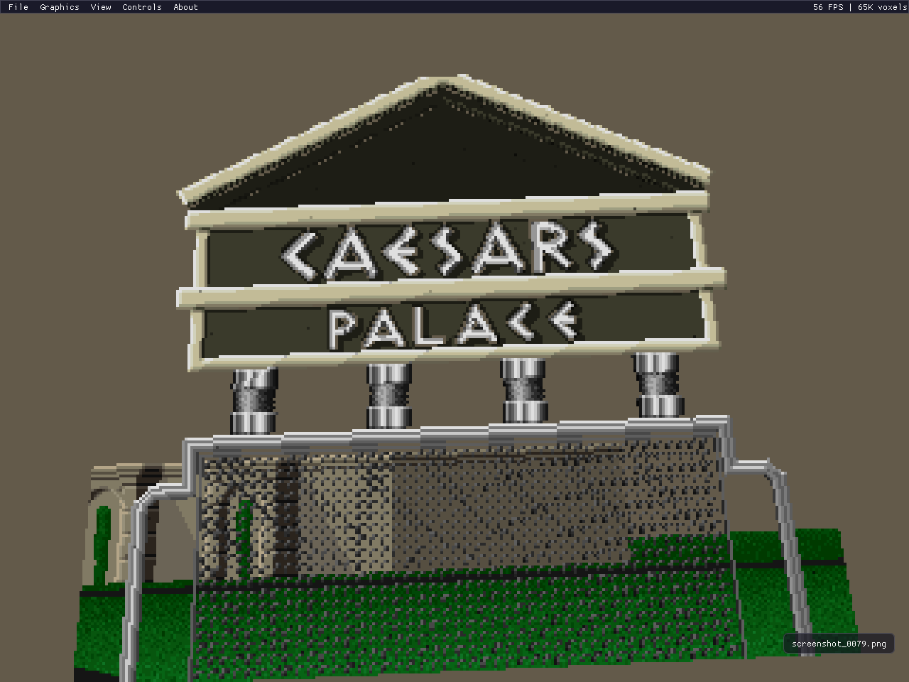

# 3dSNES

**A free, open-source 3D voxel renderer for SNES games.**

Runs real SNES emulation (powered by [LakeSnes](https://github.com/angelo-wf/LakeSnes)) and converts the 2D tile/sprite output into 3D voxel scenes in real-time. Inspired by [3dSen](https://store.steampowered.com/app/1147940/3dSen_PC/) (NES) — this is the SNES equivalent, and it's free.

## Screenshots

| | |
|:---:|:---:|
|  |  |
| *Jurassic Park — 3D voxel diorama* | *Jurassic Park — original 2D* |
|  |  |
| *Lemmings — rocky cliff in 3D* | *Lemmings — original 2D* |
|  |  |
| *Arkanoid — bricks as 3D blocks* | *Aladdin — Agrabah marketplace* |
|  |  |
| *Caesars Palace — building facade* | *TMNT IV — bridge fight* |
|  |  |
| *Zelda: ALTTP — Triforce intro* | *Chrono Trigger — pendulum intro* |
|  |  |
| *Illusion of Gaia — Earth globe* | *Super Street Fighter II — character select* |

## How It Works

1. **Emulation** — LakeSnes runs the game with full CPU, PPU, APU, and DMA emulation
2. **PPU Extraction** — Each frame, tile/sprite/palette data is read directly from PPU state (VRAM, OAM, CGRAM)
3. **Voxelization** — 2D tiles are extruded into 3D voxel blocks with per-layer depth and brightness-based height variation
4. **Rendering** — Software rasterizer draws colored cubes with directional lighting (GPU renderer planned)
5. **Display** — SDL2 presents the rendered frame with an ImGui menu overlay

## Features

- Real-time 3D voxel rendering of SNES games
- Toggle between 3D and 2D views with F1
- Automatic Mode 7 detection (seamless fallback to 2D for first-person/rotation sections)
- Full SNES audio (SPC700 + DSP)
- Orbit camera with mouse controls and preset views
- ImGui menu system (File, Graphics, View, Controls, About)
- Configurable controls with rebindable keys (2-player keyboard support)
- Save states (F5/F7)
- PNG screenshot capture (F12) with toast notifications
- Native file dialog for ROM loading
- ZIP ROM support
- Per-game voxel profiles with auto-detection
- Time-decoupled emulation (game runs at full 60fps regardless of render speed)
- Sky color auto-detection for scene background
- Automated ROM test suite (`--test` flag)

## Game Compatibility

See **[COMPATIBILITY.md](COMPATIBILITY.md)** for the full compatibility matrix with 70+ tested games, ratings, screenshots, and known issues.

## Controls

| Key | Action |
|-----|--------|
| Arrow Keys | D-pad |
| Z | B button |
| X | A button |
| A | Y button |
| S | X button |
| D / C | L / R shoulder |
| Tab | Select |
| Enter | Start |
| F1 | Toggle 3D / 2D |
| F5 | Save state |
| F7 | Load state |
| F12 | Screenshot |
| Mouse drag | Orbit camera |
| Mouse wheel | Zoom |
| Middle drag | Pan |
| 1 / 2 / 3 | Top-down / Isometric / Side view |
| Esc | Quit |

## Building

### Requirements
- CMake 3.16+
- SDL2 (via vcpkg or system)
- C17 / C++17 compiler (MSVC, GCC, Clang)

### Build
```bash
git clone --recursive https://github.com/sp00nznet/3dsnes.git
cd 3dsnes
cmake -S . -B build
cmake --build build --config Release
```

### Run
```bash
./3dsnes path/to/rom.sfc
./3dsnes path/to/rom.zip
```

Or use **File > Load ROM** from the menu.

## Architecture

```
SNES ROM (.sfc / .zip)
   |
   v
LakeSnes (full SNES emulation)
   |
   v
PPU State Extraction (VRAM, OAM, CGRAM, BG registers)
   |
   v
Voxelizer (tiles/sprites -> 3D voxel instances)
   |
   v
Software Rasterizer (cube projection, z-buffer, lighting)
   |
   v
SDL2 + ImGui (display, menu, input, audio)
```

## Credits

- [LakeSnes](https://github.com/angelo-wf/LakeSnes) by angelo-wf — SNES emulation core
- [Dear ImGui](https://github.com/ocornut/imgui) — UI framework
- [SDL2](https://www.libsdl.org/) — windowing, audio, input
- [glad](https://github.com/Dav1dde/glad) — OpenGL loader
- [stb_image_write](https://github.com/nothings/stb) — PNG export

## License

MIT
