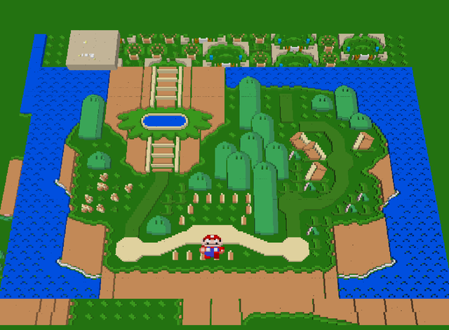
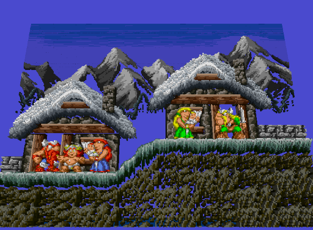
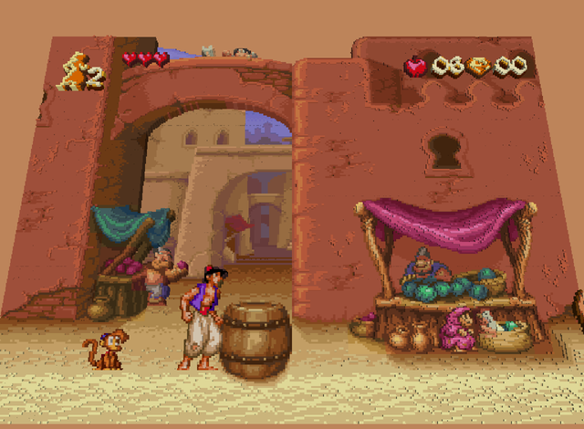
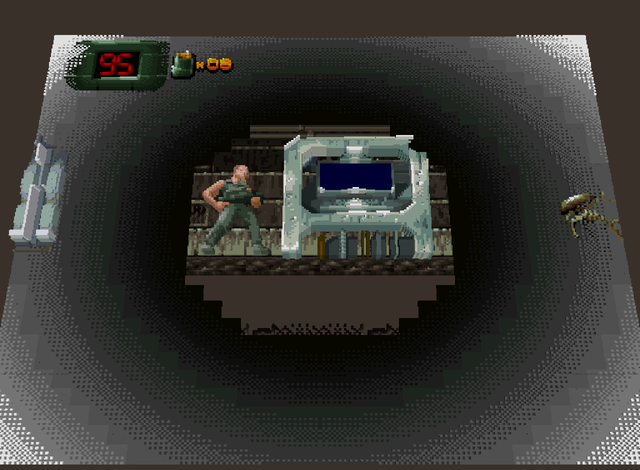
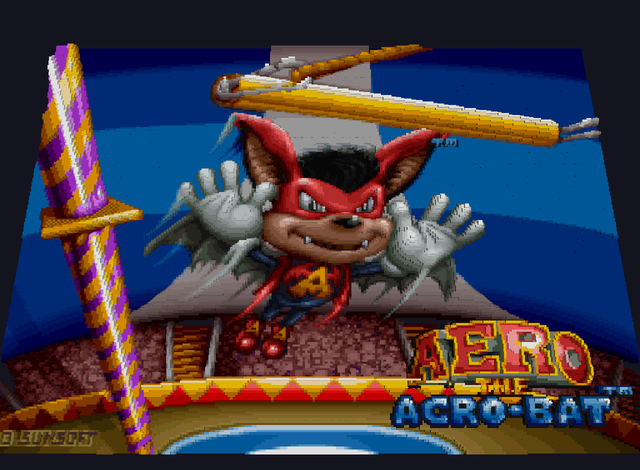
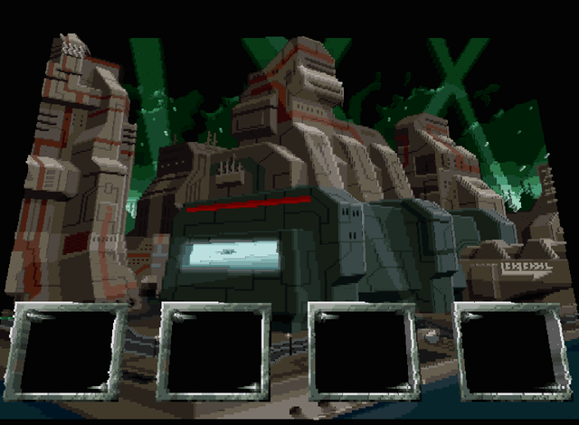
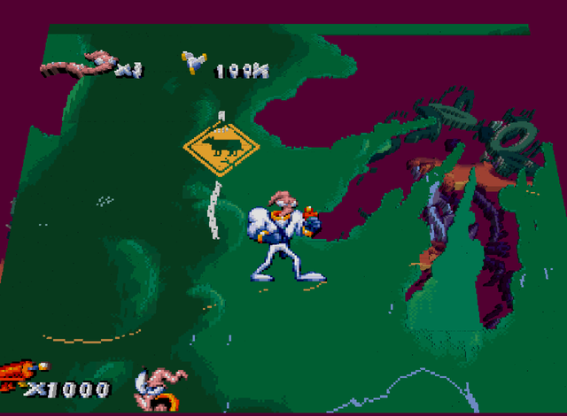

# 3dSNES

[](https://github.com/sp00nznet/3dsnes/actions/workflows/build.yml)

**A free, open-source 3D voxel renderer for SNES games.**

Download a Windows build from [Releases](https://github.com/sp00nznet/3dsnes/releases).

Runs real SNES emulation (powered by [LakeSnes](https://github.com/sp00nznet/LakeSnes)) and converts the 2D tile/sprite output into 3D voxel scenes in real-time. Inspired by [3dSen](https://store.steampowered.com/app/1147940/3dSen_PC/) (NES) — this is the SNES equivalent, and it's free.

## Screenshots

Every shot below is a straight `--test` capture from the corpus run, not a hand-posed screenshot.

| | | |
|:---:|:---:|:---:|
|  |  |  |
| *Super Mario World — overworld as a diorama* | *The Lost Vikings — huts in the snow* | *Aladdin — Agrabah marketplace* |
|  |  |  |
| *Alien 3 — corridor depth* | *Aero the Acro-Bat — big top* | *Mechwarrior — mech bay* |
|  | | |
| *Earthworm Jim* | | |

## Status

**v0.1.1** — Windows binaries on the [Releases](https://github.com/sp00nznet/3dsnes/releases) page, built by CI from the tag.

Where it stands: 340 of the 375 games in the test corpus (91%) draw a real 3D
scene, verified by an unattended run of the whole corpus rather than by
spot-checks. The renderer is a CPU rasterizer, so framerate is the main cost —
roughly 15-25 FPS at the default 3x internal resolution on a modern desktop.
Emulation is decoupled from rendering, so the game itself still runs at 60 FPS;
drop **Graphics > 3D Render Scale** to 2x or 1x to trade sharpness for speed.

### Known limitations

- **Coprocessors.** SA-1 and DSP-4 are not emulated at all. Super FX is mapped
  and clocked but does not get its games to boot. Nine corpus games are affected
  — see [COMPATIBILITY.md](COMPATIBILITY.md).
- **Mode 7** cannot be voxelized; those frames fall back to the 2D view.
- **Performance.** The software rasterizer is single-threaded.
- Only two games ship tuned per-game profiles (Zelda: ALTTP, Super Mario World).
  Everything else uses the generic profile, which is decent but not tailored.

### Testing against the corpus

`--test` boots a ROM, walks it past the attract screen with scripted input,
captures three 3D frames plus a diagnostic JSON, and exits. `test_all_roms.sh`
runs that over a ROM directory (~15s per game) and `make_compat.py` turns the
output into COMPATIBILITY.md and the gallery sheets:

```bash
ROMDIR="X:/Roms/Nintendo SNES" ./test_all_roms.sh   # LIMIT=20 for a sample
python make_compat.py
```

## Features

### Emulation
- Full SNES emulation via LakeSnes (CPU, PPU, APU/SPC700, DMA)
- Full SNES audio with per-channel mute and master volume control
- SNES Mouse support (for Mario Paint, etc.)
- Super Scope light gun support (for Super Scope 6, Yoshi's Safari, Battle Clash, etc.)
- 2-player keyboard input with rebindable keys
- Save states (F5 save / F7 load)
- LoROM, HiROM, and ExHiROM cartridge support
- Coprocessors: DSP-1 (Super Mario Kart, Pilotwings) and Super FX / GSU-2 (Star Fox, Yoshi's Island, Doom)
- ZIP ROM loading

### 3D Rendering
- Real-time voxel rendering of SNES tile/sprite layers
- Configurable directional lighting with adjustable angle, ambient, and diffuse
- Ground-plane shadow projection along the light direction
- Per-layer and per-sprite alpha transparency with back-to-front sorted blending
- Sprite grouping — adjacent multi-tile sprites merge into single coherent 3D objects
- Adjustable 3D render resolution (1x-4x of 256x224) — trades sharpness for speed
- FXAA anti-aliasing post-processing
- Gradient skybox backgrounds (configurable top/bottom colors)
- Toggle between 3D and 2D views (F1)
- Automatic Mode 7 detection with seamless 2D fallback
- Orbit camera with mouse drag, zoom (scroll wheel), and pan (middle drag)
- Preset camera views: top-down (1), isometric (2), side (3)
- Time-decoupled emulation — game runs at 60fps regardless of render speed

### Per-Game Profiles
- Voxel profiles with per-BG-layer depth, height, and extrusion settings
- Lighting, shadow, transparency, sky, and sprite grouping settings per game
- Auto-detection by ROM checksum and internal name
- Built-in Scene Editor for tweaking all settings in real-time
- Profile save/load as JSON

### UI
- ImGui menu system (File, Graphics, View, Controls, About)
- Scene Editor with sections for layers, lighting, shadows, transparency, sprite grouping, and sky
- FPS and voxel count display
- PNG screenshot capture (F12) with toast notifications
- Native file dialog for ROM loading (Windows)
- Debug console

## Game Compatibility

All 375 US clean-dump ROMs in the test corpus are run unattended through `--test` and scored from the captures:

| Status | Games |
|---|---:|
| 3D view draws the scene | 340 (91%) |
| Mode 7 — falls back to 2D by design | 24 (6%) |
| 3D view empty | 2 (1%) |
| Does not boot (unsupported coprocessor) | 9 (2%) |

See **[COMPATIBILITY.md](COMPATIBILITY.md)** for the per-game table and gallery sheets of every game.

Not booted: SA-1 (Kirby Super Star, Super Mario RPG, Street Fighter Alpha 2) and DSP-4 (Top Gear 3000) are not emulated at all. Super FX is wired up but does not get Star Fox, Yoshi's Island, Vortex, Stunt Race FX or Dirt Trax FX to turn the screen on.

## Controls

| Key | Action |
|-----|--------|
| Arrow Keys | D-pad |
| Z | B button |
| X | A button |
| A | Y button |
| S | X button |
| D / C | L / R shoulder |
| Tab | Select |
| Enter | Start |
| F1 | Toggle 3D / 2D |
| F4 | Capture / release SNES mouse or Super Scope |
| T | Toggle Super Scope turbo (when captured) |
| F5 | Save state |
| F7 | Load state |
| F12 | Screenshot |
| Mouse drag | Orbit camera |
| Mouse wheel | Zoom |
| Middle drag | Pan |
| 1 / 2 / 3 | Top-down / Isometric / Side view |
| Esc | Quit |

### Command line

```
3dsnes <rom>                     load a ROM
3dsnes <rom> --render-scale 2    1-4, internal 3D resolution multiplier (default 3)
3dsnes <rom> --test              capture the corpus screenshots + diagnostic JSON, then exit
```

## Building

### Requirements
- CMake 3.16+
- SDL2 (via vcpkg or system)
- C17 / C++17 compiler (MSVC, GCC, Clang)

### Build
```bash
git clone --recursive https://github.com/sp00nznet/3dsnes.git
cd 3dsnes
cmake -S . -B build
cmake --build build --config Release
```

### Run
```bash
./3dsnes path/to/rom.sfc
./3dsnes path/to/rom.zip
```

Or use **File > Load ROM** from the menu.

## Architecture

```
SNES ROM (.sfc / .zip)
   |
   v
LakeSnes (full SNES emulation)
   |
   v
PPU State Extraction (VRAM, OAM, CGRAM, BG registers)
   |
   v
Voxelizer (tiles/sprites -> 3D voxel instances)
   |
   +--- Sprite Grouping (merge adjacent sprites)
   +--- Per-layer alpha / transparency
   |
   v
Software Rasterizer
   |
   +--- Directional lighting (configurable angle)
   +--- Two-pass: opaque (z-write) then transparent (sorted, blended)
   +--- Ground-plane shadow projection
   +--- FXAA anti-aliasing
   |
   v
SDL2 + ImGui (display, menu, input, audio)
```

## Credits

- [LakeSnes](https://github.com/sp00nznet/LakeSnes) (fork of [angelo-wf/LakeSnes](https://github.com/angelo-wf/LakeSnes)) — SNES emulation core
- [Dear ImGui](https://github.com/ocornut/imgui) — UI framework
- [SDL2](https://www.libsdl.org/) — windowing, audio, input
- [glad](https://github.com/Dav1dde/glad) — OpenGL loader
- [stb_image_write](https://github.com/nothings/stb) — PNG export

## License

MIT — see [LICENSE](LICENSE) for the full text and third-party notices.

Note: DSP-1 emulation inside the LakeSnes fork is ported from Snes9x, whose
license restricts commercial use. Building without DSP-1 keeps the tree MIT-only.
